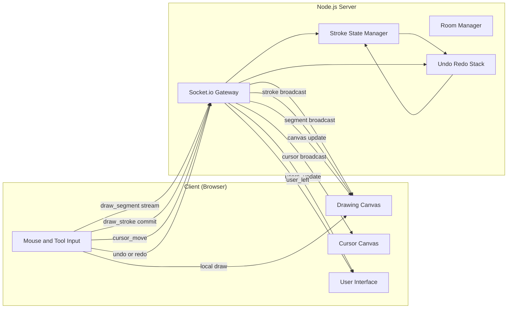

## Architecture – Real-Time Collaborative Drawing Canvas

---

## 1. Overview

This document describes the system architecture, data flow, WebSocket protocol, and design decisions behind the Real-Time Collaborative Drawing Canvas application. The system enables multiple users to draw simultaneously on a shared canvas with real-time synchronization, live cursor indicators, and global undo/redo functionality.

---

## 2. High-Level Architecture

### Components

* **Client (Browser)**

  * React application
  * Drawing Canvas (persistent strokes)
  * Cursor Canvas (transient cursors)
* **Server**

  * Node.js + Socket.io
  * Room Manager (users & sessions)
  * State Manager (stroke history)

---

## Data Flow Diagram 

### Key Idea

The server acts as the **single source of truth**, while clients handle rendering and user interaction.

---

## 4. WebSocket Protocol

### Events Sent by Client

| Event          | Payload               | Purpose                             |
| -------------- | --------------------- | ----------------------------------- |
| `draw_segment` | `{ from, to, style }` | Stream stroke segments in real time |
| `draw_stroke`  | `{ stroke }`          | Commit completed stroke             |
| `cursor_move`  | `{ x, y }`            | Share cursor position               |
| `undo`         | none                  | Undo last global stroke             |
| `redo`         | none                  | Redo last undone stroke             |

---

### Events Sent by Server

| Event          | Payload                   | Purpose                    |
| -------------- | ------------------------- | -------------------------- |
| `init_state`   | `[strokes]`               | Sync canvas for new user   |
| `draw_segment` | `{ from, to, style }`     | Relay live drawing         |
| `draw_stroke`  | `{ stroke }`              | Broadcast committed stroke |
| `cursor_move`  | `{ userId, x, y, color }` | Broadcast cursor position  |
| `users_update` | `[users]`                 | Update online users list   |
| `user_left`    | `{ userId }`              | Remove disconnected user   |
| `undo`         | none                      | Sync undo across clients   |
| `redo`         | `{ stroke }`              | Sync redo across clients   |

---

## 5. Undo / Redo Strategy 

* The server maintains a **global stroke history**.
* Undo removes the most recent stroke (regardless of user).
* Redo reapplies the last undone stroke.
* All clients **replay stroke history** to maintain consistency.

### Eraser Handling

* Eraser actions are stored as strokes using `destination-out`.
* Undo restores erased content.
* Redo reapplies the erase.

---

## 6. Performance Decisions 

### Key Optimizations

* **Two-canvas architecture**

  * Prevents cursor redraw from affecting strokes
* **Stroke-based state**

  * Avoids pixel manipulation
  * Enables deterministic replay
* **Streaming vs Committing**

  * `draw_segment` for responsiveness
  * `draw_stroke` for authoritative state
* **useRef instead of React state**

  * Avoids unnecessary re-renders

---

## 7. Conflict Resolution 

* No locking is required.
* Strokes are appended sequentially on the server.
* Concurrent drawing is handled deterministically by stroke order.
* Global undo/redo ensures consistent state for all users.

---

## 8. Known Limitations

* Performance may degrade with very large numbers of concurrent users.
* No persistence (canvas resets when server restarts).
* No authentication or authorization.

---

## 9. Summary

This architecture cleanly separates rendering, interaction, and synchronization concerns. By combining real-time stroke streaming with authoritative state management on the server, the system delivers smooth collaboration while maintaining consistent global state.

---
